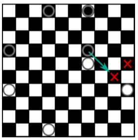
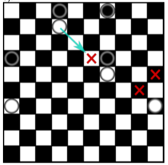
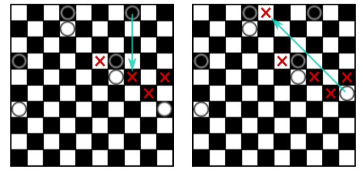

##### Fritz Raluca-Mihaela
##### Artifical Intelligence KR Mini-Project

---

## 13. Jocul amazoanelor Descrierea jocului
    
Se va implementa jocul amazoanelor (Game of the amazons). Jocul este turn based. Un jucător va folosi piese albe, celălalt negre. Jucătorul cu piese negre este cel care mută primul.  

Jocul se joacă pe tabla de joc stil tablă de șah dar de dimensiune 10X10, și piesele sunt inițial puse ca în imaginea
de mai jos:

  

Regulile și desfășurarea jocului Jucătorul cu piese albe mută primul. O mutare are două acțiuni:   

1. mutarea unei piese pe tablă oricâte poziții în linie dreaptă, pe rând, coloană sau diagonală (în stilul reginei de la sah), dar numai cu condiția să nu fie alte piese pe acel traseu (piesa nu poate sări alte piese).  

2. Lansarea unei "săgeți" care de asemenea poate merge în linie dreaptă pe rând, coloană sau diagonală însă fără a trece printr-o celulă cu o altă piesă în ea. În locul în care a ajuns săgeata se plasează o piesă specială (în imagine e marcat cu un x).  
   
Vom considera liniile și coloanele numerotate de la 0 până la 9 inclusiv.
De exemplu, în imaginea de mai jos, a mutat jucătorul cu piese albe, piesa de la (linia 9, coloana 6) la (linia 4, coloana 6) (deci s-a mutat pe coloană). Săgeata a fost trasă la (linia 4, coloana 9) (deci a fost trasă pe linie).  

   

Mai departe mută jucătorul cu piese negre de pe (linia 3, coloana 9) pe (linia 3, coloana 6). Săgeata este trasă pe diagonală la (linia 5, coloana 8). De exemplu, jucătorul cu piese negre nu ar fi putut să tragă săgeata pe coloană în jos, fiindcă era o piesă albă acolo.   

  

Jucătorul cu piese albe a mutat de la (linia 9, coloana 3) la (linia 1, coloana 3) și a tras săgeata la (linia 3, coloana 5).  

   

Mai jos e o succesiune de mutări:  

  

  

  

  

Observăm că în urma ultimei mutări de sus, piesa albă de la (linia 5, coloana 9) este blocată (nu se mai poate deplasa). Jocul nu e pierdut pentru alb fiindcă mai are piese disponibile.

#### Terminarea jocului

Jocul se termină când unul dintre jucători nu mai are mutări, caz în care jucătorul respectiv pierde, iar adversarul său câștigă. De exemplu, în tabla de mai jos, ar fi rândul jucătorului cu piese albe, dar nicio piesă nu mai are un loc liber în care să se mute. Prin urmare, a câștigat jucătorul cu piese negre.  

Exemplu de stare finală:  

## Rezolvare:

#### CLASA JOC
Pentru inceput, am definit clasa `Joc` care contine variabilele:
- `NR_COLOANE` => Numar coloane joc
- `JMIN` => Jucatorul
- `JMAX` => Calculatorul
- `GOL` => `#` cand este loc liber 
- `SAGEATA` => `X` cand se foloseste optiunea sageata

In contrusctorul acestei clase am initializat o matrice care va reprezenta de fapt tabla de joc si folosit functia `start()` care initializaeza piesele jucatorilor in pozitiile de start, adica pentru linii de la 0 la 9 si 
coloane de la 0-9:
- piesele negre se vor afla pe:
  - linia 0 coloanele 3 si 6
  - linia 3 coloanele 0 si 9
- piesele albe se vor afla pe:
  - linia 9 coloanele 3 si 6
  - linia 6 coloanele 0 si 9

Tot in aceasta clasa, avem o functie care in functie de jucatorul introdus, va returna oponentul acestuia.

Am creat, de asemenea, functii ajutatoare precum `changeCoord()` si `getAtCoord()` care imi schimba pozitia unei piese pe tabla de joc si repectiv imi returneaza valoarea(`Joc.GOL`, `B`, `W` sau `X`) aflata la un anumit set de coordonate (linie, coloana).  

In continuare am creat o functie care estimeaza scorul, impreuna cu o functie de afisare.

Pentru verificarea daca o anumita mutare este posibila, am creat in clasa `Joc` 3 functii care verifica daca modurile de mutare sau introducere a unei sageti sunt posibile, cu alte cuvinte, daca pana la o pozitie tinta cu coordonatele `linieScop` si `coloanaScop` nu se gaseste vreo piese diferita de `Joc.GOL`, atunci se va returna `Adevarat`. Acest rezultat, fie `Adevarat` sau `Fals`, va fi necesar ulterior cand se vor prelua diverse comenzi de la jucator sau calculator, pentru validarea mutarilor posibile versus celor imposibile.  

#### CLASA PIESA
Clasa `Piesa` este ajutatoare pentru a putea memora mai usor un set de coordonate si de preluare a acestora. In clasa `Stare` se vor regasi 2 liste care retin piesele albe si negre, impreuna cu pozitiile acestora, prin intermediul acestei clase.

#### CLASA STARE
Clasa `Stare` este echivalenta clasei `NodParcurgere` din cadrul temelor de cautare cu algoritmul `A*` si reprezinta un nod in arborelee `MinMax`.  

Aceasta clasa are propritatile:
- tabla de joc
- jucatorul curent
- adancime
- estimare
- lista de mutari posibile
- lista pieselor albe
- lista pieselor negre
- starea aleasa

In cadrul acestei clase se regasesc 2 functii principale: `mutari()` si `afisFinal()` in cadrul carora se mentine o lista a mutarilor, respectiv se afiseaza rezultatul final al jocului.

#### CLASA MAIN 
Datorita comoditatii, in aceasta clasa se afla toate clasele mentionate anterior, impreuna cu o serie de functii.

Principala functie folosita in aceasta clasa este functia `play()` care efectueaza:
- validarea alegerii algoritmului ce va fi folosit ulterior,
- initalizarea jucatorilor (validarea alegerii piesei folosite de catre jucator si initialziare calculatorului ca fiind oponentul acestuia)  
- initializarea tablei de joc
- initaliazarea starii initiale de joc
- dupa fiecare schimbare, se va printa tabla de joc in statusul actual
- la fiecare schimbare de tura, se va afisa un mesaj precum: `Este randul tau!` sau `Este randul calculatorului!`.
- exista 2 variante de mutare: 
  - mutare a piesei
  - mutare de tip adaugare sageata
- este validata aceasta alegere a jucatorului, apoi se cere pozitia la care este mutata o piesa, respectiv adaugata o sageata.
- folosind functiile `checkVertical()` `checkOrizontal()` si `checkDiagonala()` se va valida locatia introdusa de jucator / calculator si se vor muta / adauga piese/sageti.

Cand este randul Calculatorului, se va prelua timpul inainte de mutare si dupa mutare si se va calcula cat timp a durat pana cand calculatorul a realizat o mutare.  

Sunt 2 tipuri de algoritmi folositi in acest caz: 
- algoritmul `MinMax`
- algoritmul `AlphaBeta`

In implementarea algoritmilor am folosit doar informatii de baza prezentate in laboratoare.